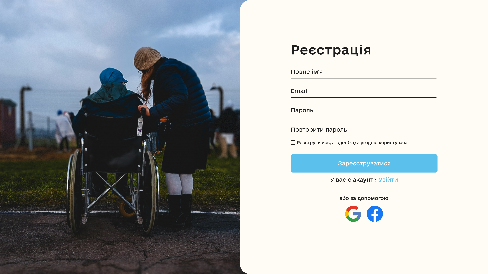
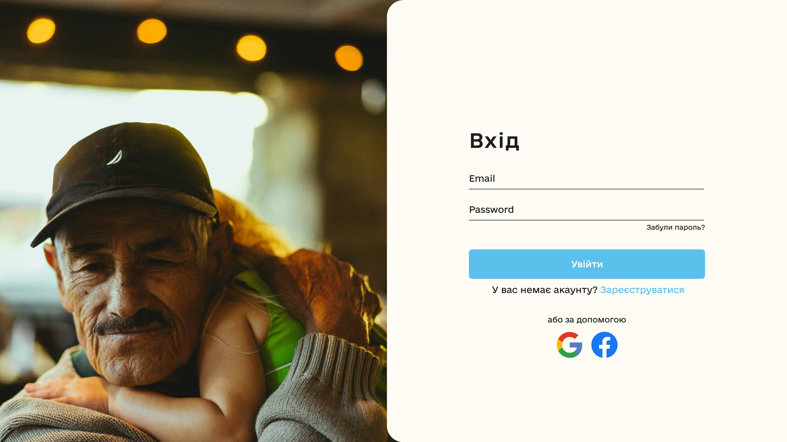
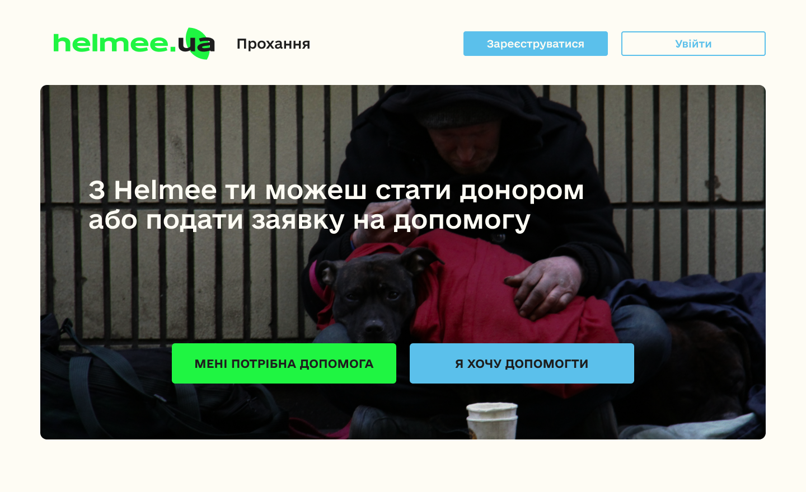
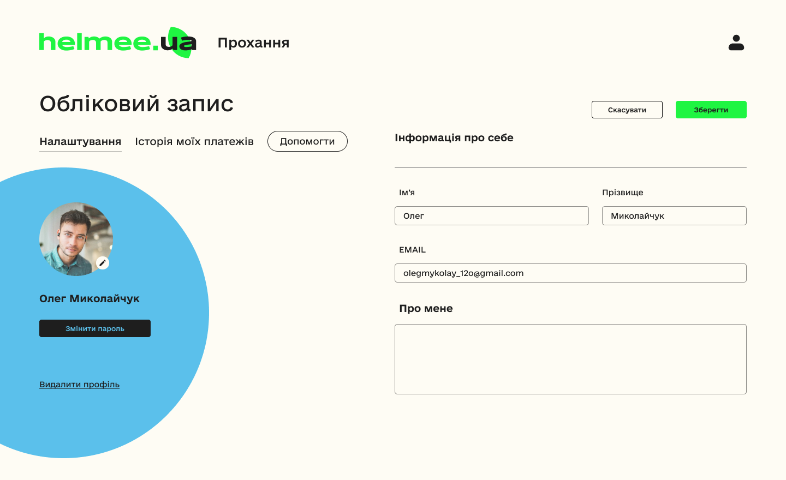
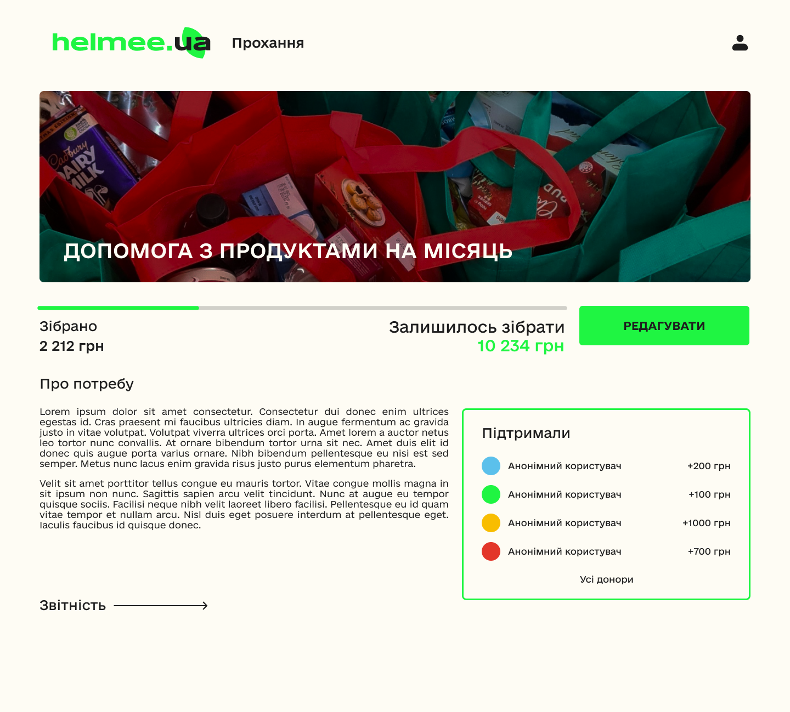
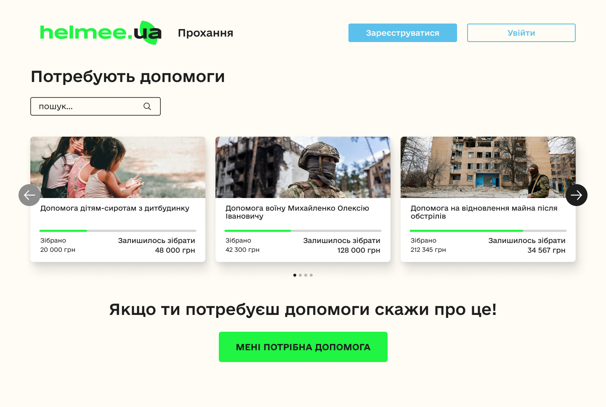
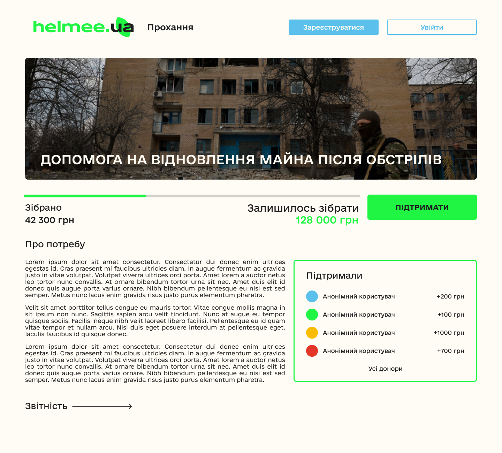
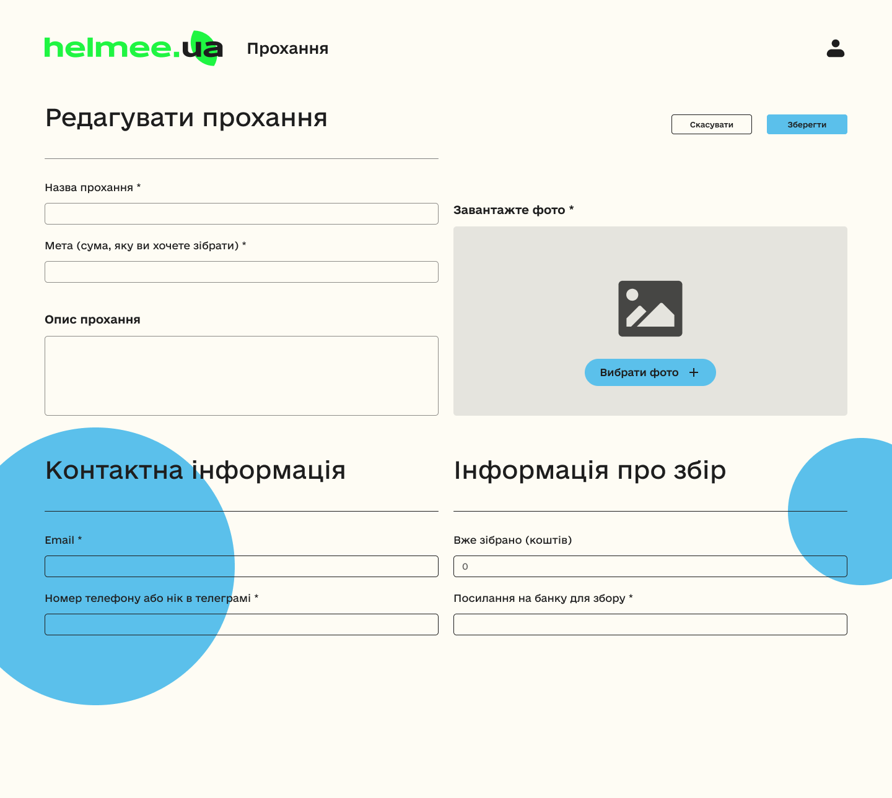

<p align="center"></p>

 [Hackaton test]() посилання на сайт(на даний момент відсутнє посилання).

 [Swagger](http://198.46.226.156/api/v1/swagger/) посилання на документацію API.


**Всім привіт, ми команда __INFERNO TEAM__ ! Ось наш вваріант тестовго завдання на хакатон**:

---

<!-- TABLE OF CONTENTS -->
<details>
  <summary>Пошук по файлу</summary>
  <ol>
    <li>
      <a href="#опис">загальна інформація</a>
    </li>
    <li>
      <a href="#міні-гайд-до-запуску-проєкту">запуск проекту</a>
    </li>
    <li>
      <a href="#стек-технологій">стек технологій</a>
    </li>
  </ol>
</details>
<br>

# Опис

>Сторінка 
**Реєстрація**
+ Поточне ім'я
+ Email
+ Пароль
+ Повторити паролю
   * Кнопка зареєструватися
<p align="center"></p>

```python

class UserRegistrationView(APIView):
    def post(self, request):
        data = {
            "username": request.data.get("username"),
            "email": request.data.get("email"),
            "password1": request.data.get("password_1"),
            "password2": request.data.get("password_2"),
            "type": request.data.get("type"),
        }

        serializer = UserAuthSerializer(data=data)

        if serializer.is_valid():
            user = serializer.save()

            return Response(
                data={
                    "user_id": str(user.id),
                    "tokens": create_jwt_pair_for_user(user=user),
                },
                status=status.HTTP_201_CREATED,
            )

        return Response(
            data={"message": serializer.errors, "status": status.HTTP_400_BAD_REQUEST},
            status=status.HTTP_400_BAD_REQUEST,
        )

```

```python

class UserAuthSerializer(serializers.ModelSerializer):
    password1 = serializers.CharField(max_length=128, write_only=True, required=True)
    password2 = serializers.CharField(max_length=128, write_only=True, required=True)

    class Meta:
        model = User
        fields = ["username", "email", "password1", "password2", "type"]

    def validate_email(self, value):
        if UserRepository.user_exists_by_email(value):
            raise serializers.ValidationError("This email is already in use.")
        return value

    def validate_username(self, value):
        if UserRepository.user_exists_by_username(value):
            raise serializers.ValidationError("This username is already in use.")
        return value

    def validate_type(self, value):
        if value not in ["assistants", "recipients"]:
            raise serializers.ValidationError("Type must be assistants or recipients.")
        return value

    def validate(self, data):
        if data["password1"] != data["password2"]:
            raise serializers.ValidationError(
                {"password2": "Password fields didn't match."}
            )

        data["password"] = data["password1"]
        return data

    def create(self, validated_data):
        validated_data.pop("password1", None)
        validated_data.pop("password2", None)

        return UserRepository.create_user(
            username=validated_data["username"],
            email=validated_data["email"],
            password=validated_data["password"],
            type=validated_data["type"],
        )

```
----

>Сторінка 
 **Вхід**
+ Email
+ Пароль
+ Кнопка **Увійти**
<p align="center"></p>

---

>**Головна сторінка сайту**
+ Дві кнопки:
+ "Мені потрібна допомога"
+ "Я хочу допомогти"
+ Посилання на сторінку реєстрації або входу

<p align="center"></p>

---

> **Обліковий запис користувача,який надає допомогу**

+ кнопка "Налаштування профілю"
+ Допомоги
<p align="center"></p>

----

>**Сторінка пошуку та вибору запитів на допомогу**
+ Аналогія до оголошень, де користувач може:
+ Скролити
+ Вибирати запити, які хоче підтримати
<p align="center"></p>

<p align="center"></p>

<p align="center"></p>

----
>**Сторінка потреби**
+ Опис потреби
+ Фото
+ Лінія показу скільки зібрано та скільки потрібно зібрати
+ Інформація про тих, хто вже підтримав
<p align="center"></p>

<p align="center"></p>

----
# Міні-гайд до запуску проєкту 

Проект складається з двох основних частин: фронтенду, реалізованого на React, та бекенду, що базується на Django REST Framework (DRF). Для запуску проекту необхідно виконати ряд дій у відповідних директоріях.

frontend:
- перейдіть до папки frontend
- підніміть контейнер:
    ``` bash
    docker-compose up --build
    ```
проєкт буде доступний на порті 3000.

backend:
- перейдіть до папки backend
- підніміть контейнер:
    ``` bash
    docker-compose up --build
    ```
- створіть та заповніть файл .env 
```
SECRET_KEY= Your secret Django key

ADMIN_PATH=admin panel url path

ALLOWED_HOSTS=localhost,127.0.0.1(examples)

DEBUG= True/False

POSTGRES_DB= Your Postgres db name
POSTGRES_USER= Your Postgres db owners name
POSTGRES_PASSWORD= Your Postgres db owners password
POSTGRES_HOST= Your Postgres db host (127.0.0.1 for localhost)
POSTGRES_PORT=Your Postgres db port (5432 default)
```

проєкт буде доступний на localhost(80 port).

---


## Дописувачі

___Дуже дякую!___

<a href="https://github.com/ostapln/test-hakaton/graphs/contributors">
  
  </a>


# Стек технологій

**FRONTEND**


[](https://developer.mozilla.org/en-US/docs/Web/HTML)[](https://developer.mozilla.org/en-US/docs/Web/CSS)[](https://developer.mozilla.org/en-US/docs/Web/JavaScript)[](https://www.typescriptlang.org/)[](https://reactjs.org/)[](https://axios-http.com/)


---
**BACKEND**

[](https://www.python.org/)[](https://www.djangoproject.com/)[](https://www.django-rest-framework.org/)[](https://redis.io/)[](https://www.docker.com/)[](https://www.nginx.com/)[](https://www.postgresql.org/)


