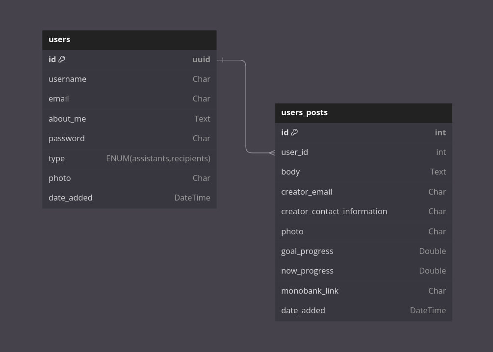

# API DOC

swagger - http://198.46.226.156/api/v1/swagger/

# Database

  <a href="https://github.com/ostapln/test-hakaton/tree/main">
    
  </a>

# Installation

## GIT

```bash
sudo apt install git
```
```bash
git clone https://github.com/ostapln/test-hakaton
```
---

## Installing Docker:

#### Updating APT packages:
```bash
sudo apt update
```

#### Installing packages to allow APT to work with HTTPS:
```bash
sudo apt install apt-transport-https ca-certificates curl software-properties-common
```

#### Adding the official Docker GPG key to your system:
```bash
curl -fsSL https://download.docker.com/linux/ubuntu/gpg | sudo apt-key add -
```

#### Adding the Docker repository:
```bash
sudo add-apt-repository "deb [arch=amd64] https://download.docker.com/linux/ubuntu $(lsb_release -cs) stable"
```

#### Update the APT packages again:
```bash
sudo apt update
```

#### Installing Docker:
```bash
sudo apt install docker-ce
```

#### Check that Docker is installed correctly:
```bash
sudo systemctl status docker
```

---

## Installing Docker Compose:

#### Updating APT packages:
```bash
sudo apt update
```

#### Downloading the latest version of Docker Compose:
```bash
sudo curl -L "https://github.com/docker/compose/releases/download/1.29.2/docker-compose-$(uname -s)-$(uname -m)" -o /usr/local/bin/docker-compose
```

#### Giving the file executable rights:
```bash
sudo chmod +x /usr/local/bin/docker-compose
```

#### Check your Docker Compose installation:
```bash
docker-compose --version
```


## Start the project:

```bash
docker-compose up -d
```